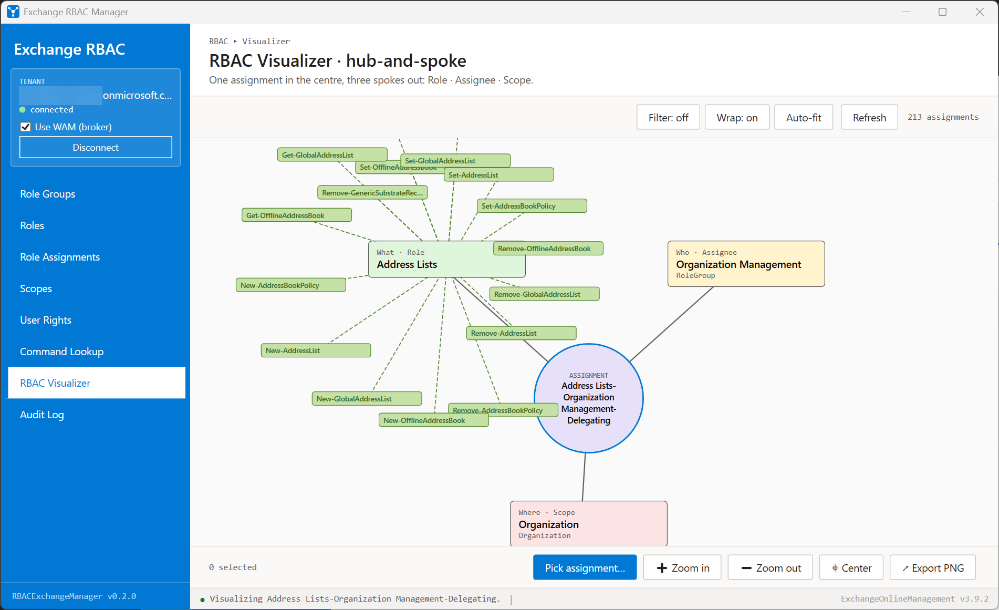
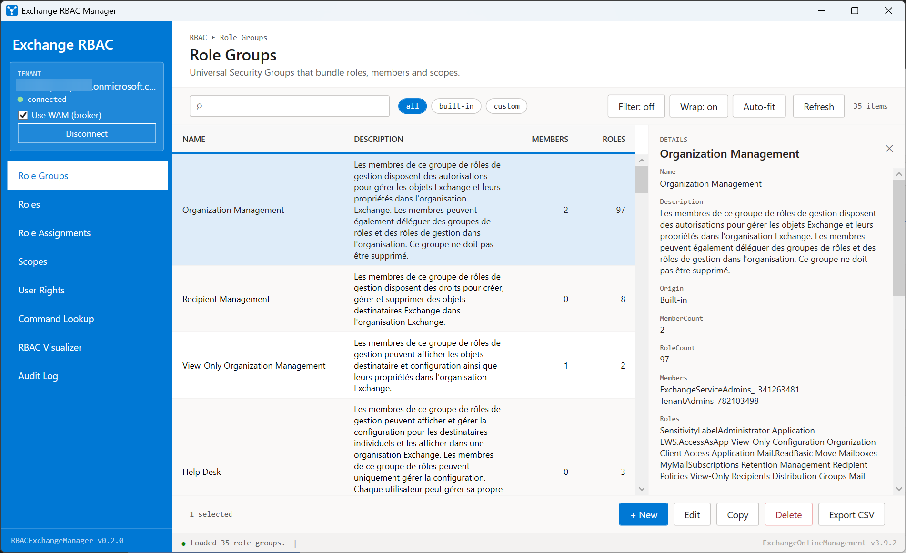
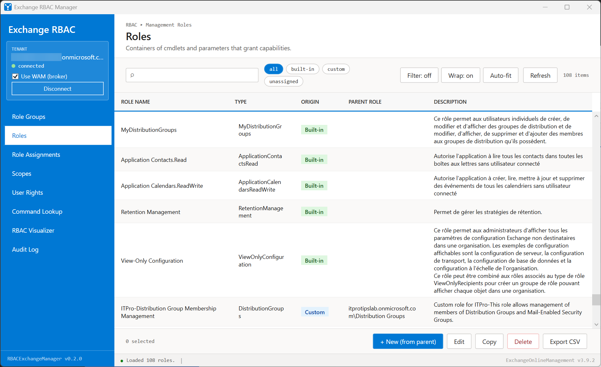
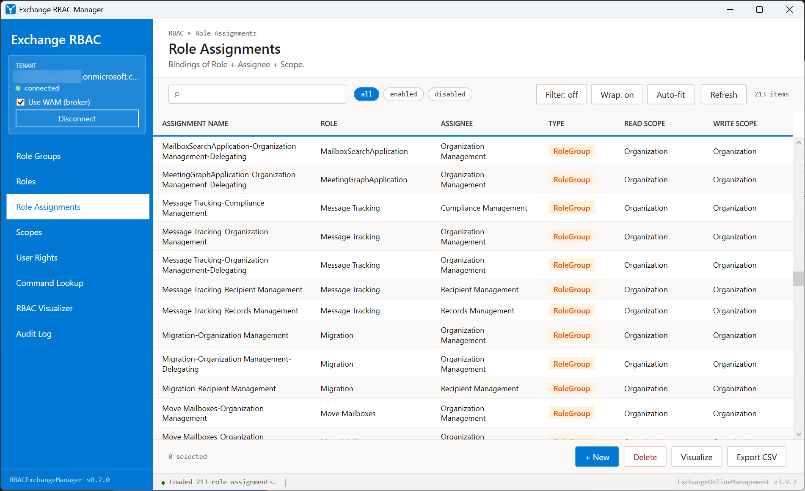
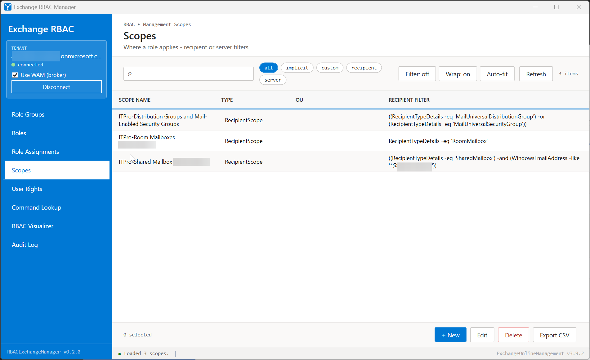
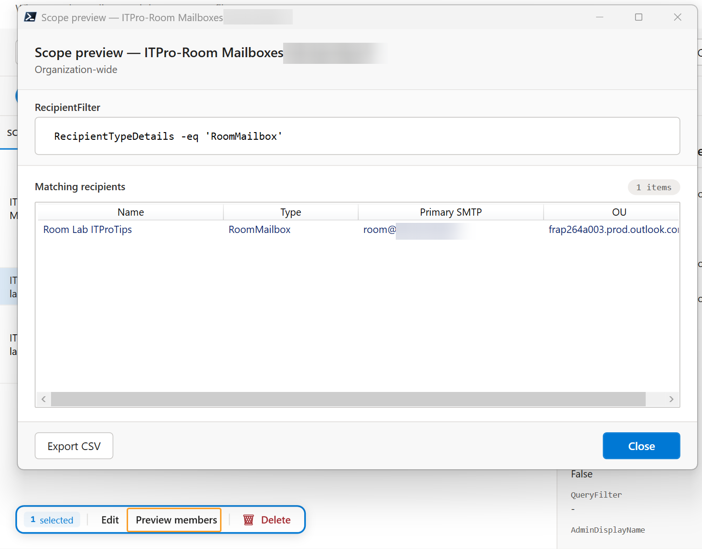
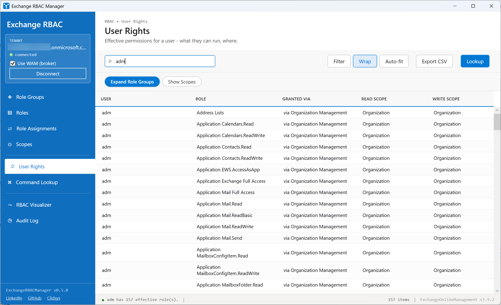
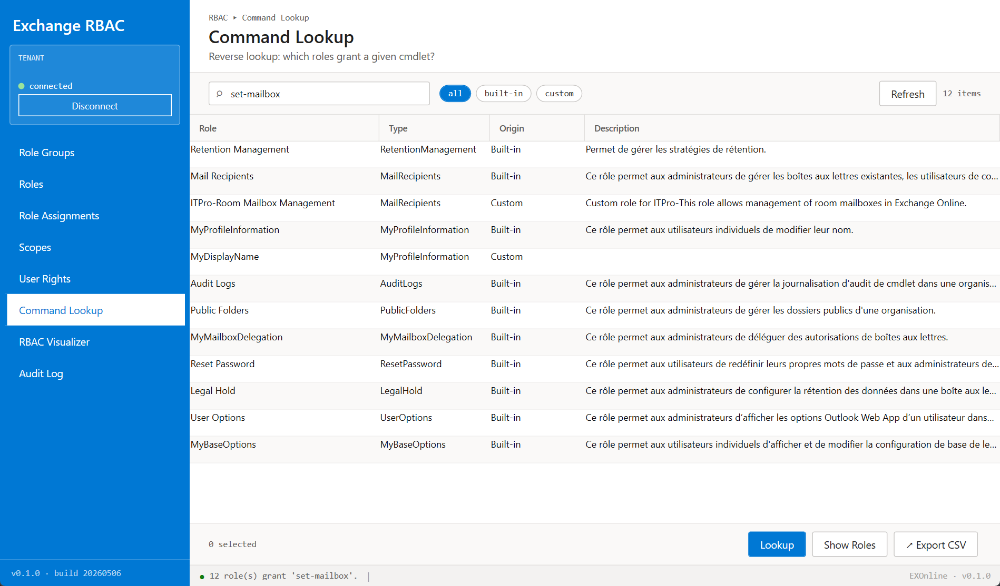

[](https://www.powershellgallery.com/packages/ExchangeRBACManager)
[](https://www.powershellgallery.com/packages/ExchangeRBACManager)

Exchange RBAC Manager
=====================

**PowerShell module with a Windows GUI to explore and manage Role-Based Access Control (RBAC) in Exchange Online**

Instead of stitching together `Get-RoleGroup`, `Get-ManagementRoleAssignment`, `Get-ManagementScope`, `Search-AdminAuditLog` and friends by hand, you browse and act on them through a single Fluent-style window organised by RBAC concept.

Role group copies preserve a shared custom recipient write scope and include it in the command preview. Each source assignment is checked before creation. Copies with mixed scopes, disabled or delegating assignments, unsupported restrictions, or incomplete assignment data are refused before any group or membership is created. Unrestricted copies must retain the scopes inherited from their source roles.

Features
--------

*   **RBAC Visualizer** - hub-and-spoke diagram (Role / Assignee / Scope) for any role assignment, with cmdlets coloured and grouped by verb (Read / Modify / Destructive / Create / Other). Reachable from Role Assignments **and** from Roles / Role Groups / Scopes (pick among the related assignments). Resolved scope **names** (not just the `CustomRecipientScope` type), an optional fan of the scope's resolved members, and export to **PNG** or a self-contained **interactive HTML** file
*   **Nine integrated views** - Role Groups, Roles, Role Assignments, Scopes, Scope membership preview, User Rights, Command Lookup, My Cmdlets, Audit Log
*   **My Cmdlets** - lists the cmdlets the connected account can actually run in this session, with each cmdlet's specific parameters; live-filterable by name or parameter
*   **Edit role assignments** - change the write scope (predefined / custom recipient scope picker / OU DN / clear) and the enabled flag, with a built-in cmdlet preview before any change is run
*   **Scope membership preview** - validate a `RecipientRestrictionFilter` *before* attaching it to an assignment
*   **Scope cross-reference** - the details panel of a scope shows every role assignment that references it (read / write / scope) so you can answer "where is this scope used?" without writing a script
*   **User Rights lookup** - effective roles for a UPN/alias, including how each role was granted (direct vs via group)
*   **Command Lookup** - reverse mapping cmdlet -> roles that grant it
*   **Activity log** - a collapsible drawer (bottom of the window) mirrors every status message with timestamps, auto-opens on errors, and exports to a `.log` file
*   **Live filter, contextual actions, CSV/PNG/HTML export** - on every view

What's new in 1.6.0
-------------------

*   **Visualize a user or a role, not just an assignment**: the Visualizer can now graph three subjects. **Pick user…** takes an account (UPN/alias) and draws everything it can do - a hub for the account ringed by every role it holds (directly or via a role group), with the "via" path and scope on each; click a role to list its cmdlets. **Pick role…** draws a role's cmdlets (coloured by verb group) plus a "Used by" column of the assignments/assignees that grant it. Every node keeps the copy-name and "Open in ..." navigation. The original single-assignment view is unchanged.

What's new in 1.5.0
-------------------

*   **Copy + navigate from a Visualizer node**: the node details panel now has a copy icon that copies the node's name to the clipboard, and an "Open in ..." button that jumps to that element's own section - a role to Roles (with its cmdlets), the assignment to Role Assignments, a custom scope to Scopes, an assignee or scope member to User Rights, a cmdlet to Command Lookup.

What's new in 1.4.0
-------------------

*   **New "My Cmdlets" section**: a dedicated view listing the cmdlets the connected account can run in the current Exchange Online session (resolved from the session's role-scoped module), each with its specific parameters (the 15 PowerShell common parameters are stripped out). The list is local to the session, so it loads instantly and live-filters as you type - by cmdlet name or by parameter. Includes Refresh and Export CSV; click a row to see the full parameter list in the details panel.

What's new in 1.3.0
-------------------

*   **Click a node to inspect it**: every Visualizer node (assignment hub, Role / Assignee / Scope spokes, cmdlets and scope members) is now clickable and opens the slide-out details panel with information tailored to its type - the assignment's role/assignee/scopes/enabled state, the role's cmdlet count and per-group breakdown, a cmdlet's full name and verb group, or a member's type / primary SMTP / OU. Dragging a node still works; a press without a drag is treated as a click.

What's new in 1.2.0
-------------------

*   **Visualize from any RBAC object**: the `Visualize` action is now available on Roles, Role Groups and Scopes - not just Role Assignments. Because one role / role group / scope can back several assignments, it resolves the related assignments and either jumps straight to the graph (single match) or opens a pre-filtered picker (several matches).
*   **Resolved scope names in the Visualizer**: the *Scope* node shows the custom scope's real name instead of the bare `CustomRecipientScope` type. The name is resolved from the assignment, then by re-querying it by identity, then via a reverse map (`Get-ManagementRoleAssignment -CustomRecipientWriteScope`) so even auto-managed assignments that never surface the name are covered.
*   **Scope members on the canvas**: a `Scope members` button resolves the write scope's recipients (same engine as *Preview members*) and fans them out around the *Scope* node, with a matching legend entry.
*   **Interactive HTML export**: export the current Visualizer graph to a single self-contained HTML file (SVG + vanilla JS, no dependencies, works offline) with pan / zoom, node drag, hover highlight, a details panel and a legend.
*   **Activity log drawer**: a collapsible log at the bottom of the window records every status message (timestamped, severity-tagged), auto-opens on the first error, and can be cleared or exported to a `.log` file. Each session is also mirrored to a file in `%TEMP%`.
*   **Sortable "Pick assignment" picker**: click a column header to sort the assignment picker (toggle ascending / descending); composes with the search box.
*   **Delete actions report real failures**: write/delete actions that Exchange rejects (for example deleting a scope still referenced by an assignment) now surface the actual Exchange error instead of a false "deleted" success.

What's new in 1.0.0
-------------------

*   **Edit role assignments**: new compact dialog focused on the write scope. Pick one of four modes - Keep current / Predefined (`RecipientRelativeWriteScope` enum) / Custom recipient scope (loaded dynamically from the tenant's existing scopes) / OU distinguished name / Clear - plus an Enabled toggle. Read scope stays read-only with an explanation that it is inherited from the parent Role and not editable at assignment level in Exchange Online.
*   **Visualizer grouped by verb**: cmdlets granted by the selected role are now sorted and colour-coded by verb group (Read / Modify / Destructive / Create / Other), with a legend in the corner of the canvas and per-cmdlet tooltips showing the group. Nodes are draggable and the canvas now auto-grows so a node dragged off-screen remains accessible via the scrollbars.
*   **Scope "Used by" panel**: clicking a scope in the Scopes view lists every assignment that references it in the details panel.
*   **Built-in vs Custom classification fixed across the board**: Roles now classify built-in vs custom from `IsRootRole` / `IsEndUserRole` / parent-of-others (the My* roles were previously mis-flagged Custom). Scopes carry an `Origin` badge driven by the `Default` property.
*   **Sturdier Scopes pipeline**: `Get-ManagementScope` multi-valued filters are now rejoined with `-or` instead of being concatenated by spaces (which produced invalid OPATH on preview). The Scopes view also recovers gracefully if EXO returns one bad scope - it logs a warning and keeps the rest.
*   **Auth UX**: WAM is now off by default (one click on the *i* icon next to the checkbox explains what WAM is). A loading overlay covers the window during browser sign-in. The `SynchronizationContext` is temporarily cleared around the call to work around a deadlock between MSAL.NET and the WPF dispatcher that left the GUI frozen after the browser had returned.
*   **Lazy data loading**: connecting no longer auto-loads Role Groups. The status bar invites you to pick a section in the sidebar, with an indeterminate progress overlay during each fetch.
*   **Audit Log section temporarily gated** behind a "coming soon" notice while the implementation is finalised.
*   **Status bar revamped**: taller, Segoe UI 14 SemiBold, wraps long messages, colour-coded per severity (error in red, warn in amber, ok in default, info in Fluent blue).
*   **Floating contextual action bar restyled** to a light Fluent pill with a coloured outline, anchored to the data column only (no longer overlaps the details panel when it slides out).
*   **README revamped**: badges, dedicated "headline feature" section for the Visualizer, expanded section-by-section walkthrough.

Quick Start
-----------

### Installation

Install directly from the PowerShell Gallery:

```powershell
Install-Module -Name ExchangeRBACManager -Scope CurrentUser
```

To update later:

```powershell
Update-Module -Name ExchangeRBACManager
```

### Basic Usage

```powershell
# Import the module
Import-Module ExchangeRBACManager

# Launch the GUI
Invoke-ExchangeRBACManager
```

A single window opens. Click **Connect to Exchange Online** in the sidebar to authenticate; the tenant block then turns green and the active section loads its data.

### Requirements

- Windows PowerShell 5.1 or PowerShell 7+
- [`ExchangeOnlineManagement`](https://www.powershellgallery.com/packages/ExchangeOnlineManagement) (auto-installed on first launch if missing)
- An Exchange Online tenant and an account with the appropriate Exchange RBAC role (at minimum **View-Only Organization Management** for read scenarios, **Organization Management** for write actions)

RBAC Visualizer - the headline feature
--------------------------------------



RBAC in Exchange Online is a triangle: **what** (a role), **who** (an assignee) and **where** (a scope). The Visualizer turns any role assignment into a hub-and-spoke diagram so you can answer those three questions in one glance instead of cross-referencing four cmdlets.

Pick any role assignment and you get:

- **Centre (purple)** - the assignment itself
- **Top-left (green)** - the *Role* it grants (the **what**)
- **Top-right (yellow)** - the *Assignee* it applies to (the **who**)
- **Bottom (pink)** - the *Scope* it is restricted to (the **where**)

Buttons:

- **Pick assignment... / Pick user... / Pick role...** - graph a single assignment, an account (every role it holds, directly or via a role group - "what can this account do?"), or a role (its cmdlets + what uses it)
- **Zoom in / Zoom out / Center** - navigate the canvas
- **Scope members** - resolve the write scope's recipients and fan them out around the *Scope* node
- **Export PNG** - saves the canvas to a PNG for tickets, reviews or documentation
- **Export HTML** - saves a self-contained interactive graph (pan / zoom / drag / details, no dependencies, opens offline)

**Click any node** (the assignment hub, a spoke, a cmdlet or a scope member) to inspect it in the slide-out details panel - role/assignee/scope properties, the per-group cmdlet breakdown, a cmdlet's full name and verb group, or a member's type / SMTP / OU. From the panel you can **copy the node's name** (copy icon next to the title) and **jump to its own section** ("Open in ..."): a role opens in Roles, the assignment in Role Assignments, a custom scope in Scopes, an assignee/member in User Rights, a cmdlet in Command Lookup.

You can also reach the Visualizer straight from a **Role**, **Role Group** or **Scope**: select a row and click **Visualize**. Since one of those can back several assignments, you either land directly on the graph (single match) or pick from the related assignments.

Typically the section you open first when investigating an unexpected permission, preparing a change request, or documenting a delegation for an audit.

The nine sections
-----------------

Each section wraps a specific Exchange RBAC cmdlet (or composition of cmdlets) and exposes the same toolbar pattern: live search, chip filters, *Refresh*, *Export CSV*, plus contextual actions on selected rows.

### 1. Role Groups



Backed by `Get-RoleGroup`. Lists every Universal Security Group that bundles management roles with members and scopes. The grid shows the group name, an **Origin** badge (Built-in vs Custom), the number of members and roles bound to it, and the description.

Use it to inventory who-can-do-what at the group level, find empty or oversized groups, or copy a built-in group as a starting template for a tighter custom one. Selecting a group also exposes **Visualize**, which graphs one of the assignments that delegate to it.

### 2. Roles



Backed by `Get-ManagementRole`. A management role is the smallest container of cmdlets and parameters that grant a capability. The grid shows the role name, its **Type** (regular vs unscoped), an **Origin** badge (Built-in vs Custom), the **Parent role** it derives from, and the description.

Use it to understand the role hierarchy (every custom role inherits from a parent built-in role) and to find candidate roles when you are designing a least-privilege delegation. Selecting a role exposes **Visualize**, which graphs an assignment that grants it (or lets you pick when several do).

### 3. Role Assignments



Backed by `Get-ManagementRoleAssignment`. The actual binding that ties a *Role* to an *Assignee* (user, role group, USG or policy) within a *Scope*. The grid shows the assignment name, the role, the assignee, the assignee type, and both the read and write scopes.

This is the workhorse view: most "why does this user have access?" questions are answered here. Selecting an assignment lights up **Visualize** in the floating action bar so you can jump directly to the diagram.

### 4. Scopes



Backed by `Get-ManagementScope`. Scopes restrict a role assignment to a subset of recipients, servers or databases. The grid shows the scope name, the restriction type, the recipient root (when set) and the recipient filter expression.

Selecting a scope exposes **Visualize** (graph an assignment that uses it) alongside **Preview members**. A custom scope's filter is a piece of OPATH that is famously easy to write incorrectly. The next section is the antidote.

### 5. Scope membership preview



In the *Scopes* section, select a scope and click **Preview members** in the floating action bar. The module calls `Get-Recipient -RecipientPreviewFilter <scope filter>` and shows you exactly which recipients fall inside that scope's filter.

The point is to validate a `RecipientRestrictionFilter` *before* you attach it to a role assignment - so you never end up granting "Mailbox Import Export" against a scope that turns out to match the entire tenant. Results are capped to a safe number of rows and labelled as *truncated* if the scope matches more than the cap.

### 6. User Rights



Type a UPN or alias and press *Enter*. The module:

1. Walks every cached `Get-ManagementRoleAssignment`.
2. For each `RoleGroup` assignee, expands `Get-RoleGroup -Identity ... | Members`.
3. Returns every effective role plus how it was granted (direct vs via group) plus read and write scopes.

Useful before/after onboarding, offboarding, or to answer "why does this user have access to X?". Also the right view to confirm a privileged user has no leftover assignments after a role rotation.

### 7. Command Lookup



Type a cmdlet name (`Set-Mailbox`, `New-MailboxExportRequest`, ...) and press *Enter*. The module calls `Get-ManagementRole -Cmdlet <cmdlet>` and returns every role that grants it, with type, origin (Built-in / Custom) and description.

The reverse of every other section: instead of starting from a role and finding its cmdlets, you start from a cmdlet and find which role(s) would let a user run it. Indispensable when an admin reports "I get an access denied on `Set-MailboxRegionalConfiguration`" and you have to figure out which role is missing. Select one of the returned roles and click **View role** to jump straight to the Roles view for it and see its full cmdlet list.

### 8. My Cmdlets

When you connect to Exchange Online, EXO builds a session module that exposes only the cmdlets your RBAC roles grant you. This section lists them - one row per cmdlet, with the cmdlet's own parameters (the common parameters like `-Verbose` / `-WhatIf` are stripped so only the meaningful ones show). It answers "what can the account I'm connected as actually run?" without cross-referencing roles by hand.

Because the list is local to the already-loaded session module, it loads instantly and filters live as you type - match on a cmdlet name (`mailbox`) or on a parameter (`-Identity`). Click a row to see the full parameter list in the details panel, and export the whole set to CSV.

### 9. Audit Log

Planned for a future release. Clicking the *Audit Log* section currently shows a "coming soon" notice. The implementation will call `Search-AdminAuditLog` over the last 7 / 30 / 90 days (limit imposed by Exchange Online) and surface recent admin changes (caller, cmdlet, target object, parameters).

Public commands
---------------

- `Invoke-ExchangeRBACManager` - launches the GUI
- `Invoke-ExchangeRBACRelationship` - generates a standalone HTML diagram of role-group -> role -> assignment relationships (separate from the embedded Visualizer)

Links
-----

*   **PowerShell Gallery**: [ExchangeRBACManager Module](https://www.powershellgallery.com/packages/ExchangeRBACManager)
*   **Issues & Support**: [GitHub Issues](https://github.com/bastienperez/exchange-rbac-manager/issues)
*   **Source**: [github.com/bastienperez/exchange-rbac-manager](https://github.com/bastienperez/exchange-rbac-manager)

---

**Created and maintained by [Bastien Perez](https://www.linkedin.com/in/perez-bastien/) | Powered by [Clidsys](https://clidsys.com)**
